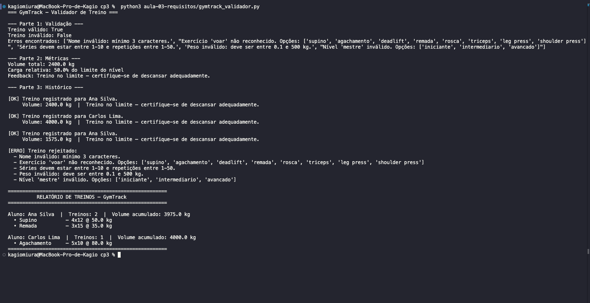
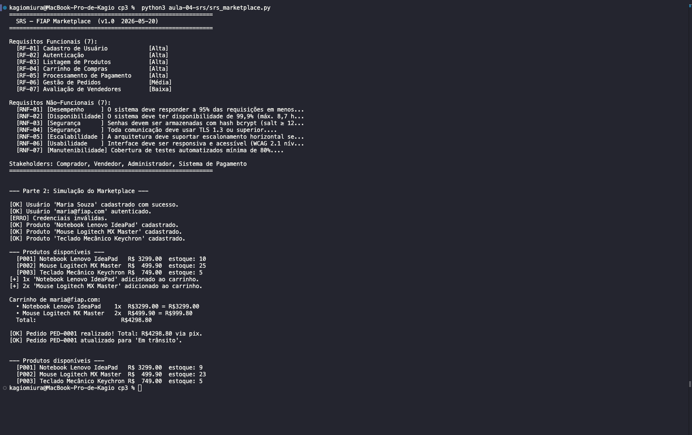
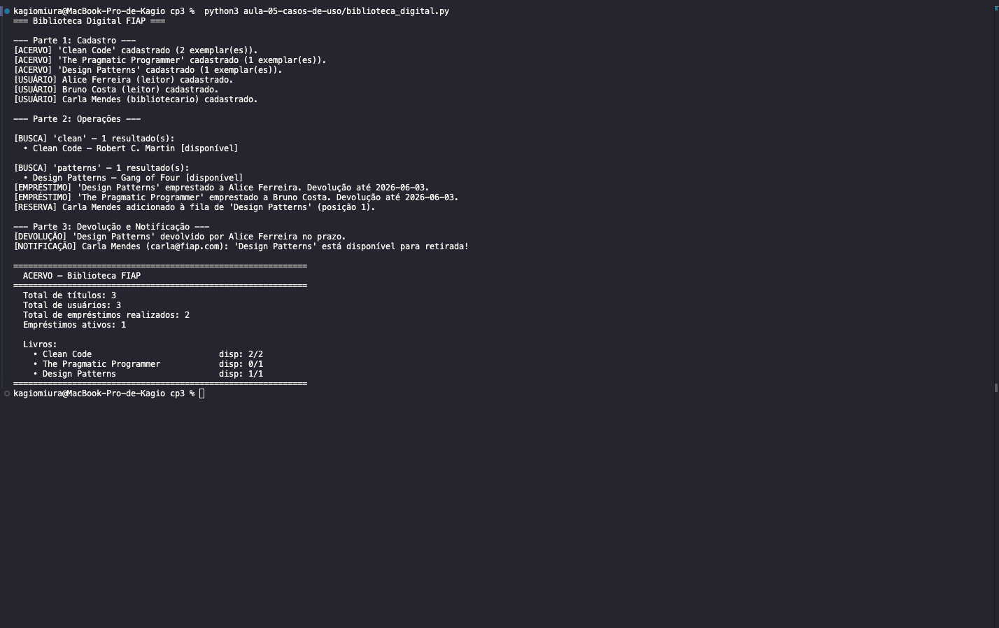
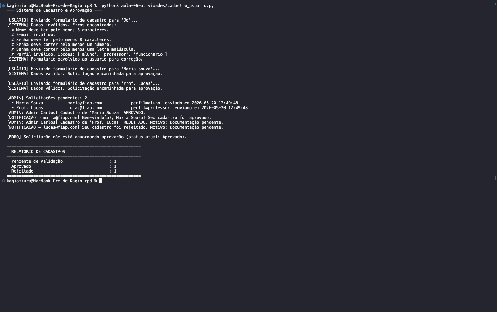
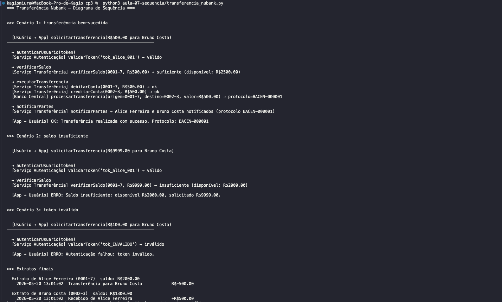
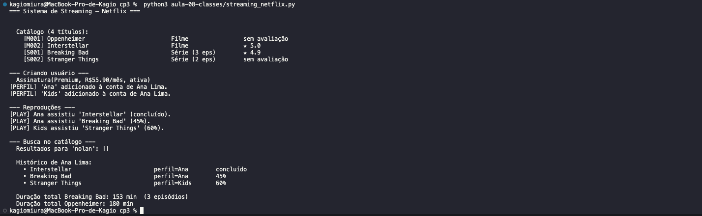

# Portfólio — Engenharia de Software | FIAP 2026

## Sobre este repositório

Portfólio individual desenvolvido na disciplina de **Engenharia de Software** do curso de Engenharia de Computação — 3º Ano (FIAP 2026). Cada pasta corresponde a uma aula prática com exercícios em Python e diagramas UML, documentando a evolução ao longo do semestre.

## Como executar os exercícios

### Pré-requisitos

- Python 3.10 ou superior
- Nenhuma dependência externa (usa apenas a biblioteca padrão)

### Instalação

```bash
# Clone o repositório
git clone https://github.com/<seu-usuario>/<nome-do-repo>.git
cd <nome-do-repo>

# Execute qualquer exercício diretamente
python aula-03-requisitos/gymtrack_validador.py
```

---

## Exercícios por Aula

### Aula 03 — Requisitos Funcionais vs. Não-Funcionais

#### Código

Arquivo: [`aula-03-requisitos/gymtrack_validador.py`](aula-03-requisitos/gymtrack_validador.py)

Sistema **GymTrack** que valida dados de treinos de academia em três partes:
- **Parte 1:** validação de entradas (nome, exercício, séries, peso e nível do aluno)
- **Parte 2:** cálculo de métricas (volume total, carga relativa) e feedback personalizado por nível
- **Parte 3:** histórico de treinos em memória e relatório consolidado por aluno

A implementação ilustra diretamente a diferença entre requisitos funcionais (o que o sistema faz) e não-funcionais (restrições de qualidade e desempenho): cada função de validação mapeia para um RF; os limites de tempo de resposta e as regras de formato de entrada mapeiam para RNFs.

#### Execução



> O terminal exibe as três partes em sequência: validação de dados válidos e inválidos, cálculo de métricas e feedback, e o relatório final com volume acumulado por aluno.

---

### Aula 04 — Documento SRS

#### Código

Arquivo: [`aula-04-srs/srs_marketplace.py`](aula-04-srs/srs_marketplace.py)

Modelagem e simulação do **FIAP Marketplace** baseada em um SRS (Software Requirements Specification):
- **Parte 1:** estrutura de dados do SRS com 7 RFs, 7 RNFs e stakeholders definidos
- **Parte 2:** simulação do sistema com classes `Produto`, `Carrinho` e `SistemaMarketplace` cobrindo cadastro, autenticação, listagem de produtos, carrinho e finalização de compra

O exercício demonstra como o SRS guia o design: cada classe e método pode ser rastreado de volta a um requisito específico (RF-01 a RF-06).

#### Execução



> Exibe o resumo do SRS e a simulação do marketplace com cadastro de usuário, autenticação, carrinho de compras e finalização de pedido via PIX.

---

### Aula 05 — UML e Casos de Uso

#### Diagrama


O diagrama modela o sistema de Biblioteca Digital com quatro atores (Leitor, Bibliotecário, Sistema de Notificação e Administrador) e casos de uso principais como Buscar Livro, Reservar Livro, Fazer Empréstimo, Devolver Livro e Gerenciar Acervo. O relacionamento `<<extend>>` entre "Reservar Livro" e "Notificar Disponibilidade" representa a notificação opcional quando o livro está indisponível.

#### Código

Arquivo: [`aula-05-casos-de-uso/biblioteca_digital.py`](aula-05-casos-de-uso/biblioteca_digital.py)

Implementação orientada a objetos da Biblioteca Digital em três partes:
- **Parte 1:** modelos `Livro` e `Usuario`
- **Parte 2:** operações de empréstimo e reserva
- **Parte 3:** sistema completo com notificações e relatório de acervo

#### Execução



> Demonstra busca, reserva, empréstimo e devolução de livros, com notificação automática para usuários na lista de espera.

---

### Aula 06 — Diagramas de Atividades

#### Diagrama


Diagrama com swimlanes representando três raias: Usuário, Sistema e Administrador. O fluxo parte do preenchimento do formulário, passa por validações automáticas do sistema e, em caso de dados válidos, aguarda aprovação manual do administrador antes de ativar a conta. Desvios de validação retornam ao usuário com mensagem de erro.

#### Código

Arquivo: [`aula-06-atividades/cadastro_usuario.py`](aula-06-atividades/cadastro_usuario.py)

Implementação do fluxo de cadastro e aprovação em Python com estados bem definidos, espelhando diretamente as swimlanes do diagrama.

#### Execução



> Mostra o fluxo completo: tentativa com dados inválidos, cadastro bem-sucedido em estado pendente e aprovação pelo administrador.

---

### Aula 07 — Diagramas de Sequência

#### Diagrama


O diagrama representa a interação entre cinco participantes: Usuário, App Nubank, Serviço de Autenticação, Serviço de Transferência e Banco Central. Mostra o fluxo de mensagens síncronas e assíncronas desde a solicitação até a confirmação final, incluindo o loop de verificação de saldo e o bloco alternativo para transferência insuficiente.

#### Código

Arquivo: [`aula-07-sequencia/transferencia_nubank.py`](aula-07-sequencia/transferencia_nubank.py)

Simulação do fluxo de transferência bancária inspirado no Nubank, implementando autenticação, verificação de saldo, débito/crédito e notificações.

#### Execução



> Demonstra transferência bem-sucedida e tentativa com saldo insuficiente, com todas as mensagens do diagrama de sequência representadas como chamadas de método.

---

### Aula 08 — Diagramas de Classes

#### Diagrama


Diagrama com hierarquia de herança (`Conteudo` como classe base para `Filme` e `Serie`), associações (`Usuario` possui `Perfil`, `Assinatura` e histórico de `Reproducao`) e dependências com o `CatalogoService`. Multiplicidades indicam que um usuário pode ter até 5 perfis e uma assinatura ativa por vez.

#### Código

Arquivo: [`aula-08-classes/streaming_netflix.py`](aula-08-classes/streaming_netflix.py)

Implementação em Python do sistema de streaming com herança, encapsulamento e polimorfismo.

#### Execução



> Exibe criação de usuário, assinatura, navegação no catálogo, reprodução de conteúdo e histórico de visualizações.

---

### Aula 09 — Arquitetura MVC

#### Imagens

| To-Do List MVC | Protótipo Figma |
|---|---|
|  |  |

O diagrama ilustra a separação entre Model (dados das tarefas), View (interface de lista e formulário) e Controller (lógica de adicionar, concluir e excluir tarefas). O protótipo no Figma apresenta as telas de listagem e criação de tarefa com fluxo de navegação.

---

## Links

- Repositório: [github.com/\<seu-usuario\>/\<nome-do-repo\>](https://github.com)
- Disciplina: Engenharia de Software — FIAP 2026
- Professor: Prof. Hercules Ramos
